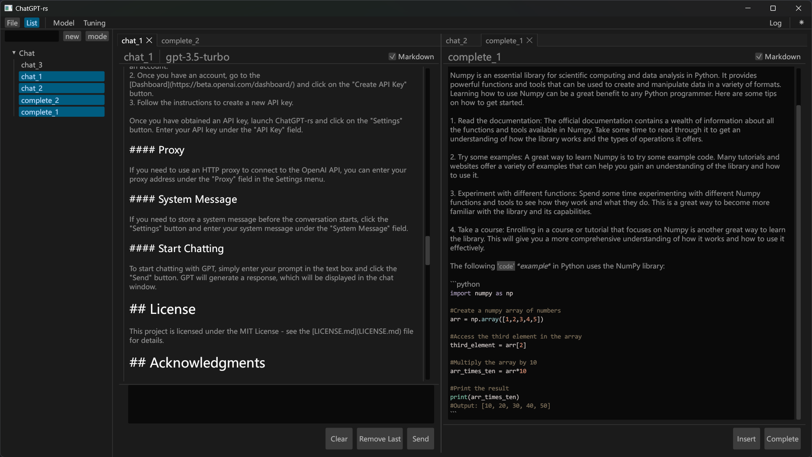

# ChatGPT-rs

ChatGPT-rs is a lightweight ChatGPT client with a graphical user interface, written in Rust. It allows you to chat with OpenAI's GPT models through a simple and intuitive interface.



## Getting Started

### Downloading

You can download the latest release of ChatGPT-rs from the [Releases](https://github.com/LitangDingzhen/chatgpt-rs/releases) page on GitHub. Choose the appropriate package for your operating system and follow the instructions to download and extract it to a directory of your choice.

### Usage

#### API Key

Before you can use ChatGPT-rs, you need to obtain an OpenAI API key. To obtain an API key, follow these steps:

1. Go to the [OpenAI API](https://beta.openai.com/) website and sign up for an account.
2. Once you have an account, go to the [Dashboard](https://platform.openai.com/account/api-keys) and click on the "Create new secret key" button.
3. Follow the instructions to create a new API key.

Once you have obtained an API key, create a `.env` file in the root directory of the project and add the following line:

```
OPENAI_API_KEY=YOUR_SECRET_KEY
```

Replace `YOUR_SECRET_KEY` with your actual API key.

#### Proxy

If you need to use an HTTP proxy to connect to the OpenAI API, you can add the following line to the `.env` file:

```
HTTP_PROXY=YOUR_PROXY_ADDRESS
```

Replace `YOUR_PROXY_ADDRESS` with your actual proxy address.

#### System Message

If you need to store a system message before the conversation starts, you can add the following line to the `.env` file:

```
SYSTEM_MESSAGE=YOUR_MESSAGE
```

Replace `YOUR_MESSAGE` with your actual system message. The first chat message will be stored as the system message.

### Start Chatting

To start chatting with GPT

You will be prompted to enter the prompt you want to use to start the conversation. After that, you can start chatting with GPT!

## License

This project is licensed under the MIT License - see the [LICENSE](LICENSE) file for details.