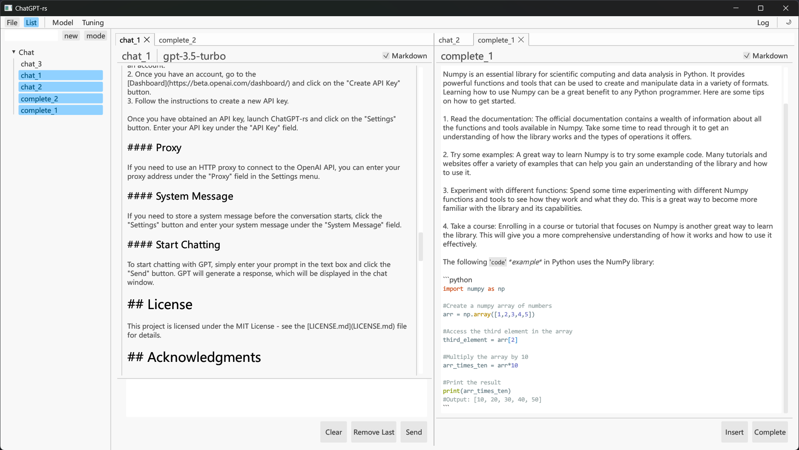

# ChatGPT-rs

ChatGPT-rs is a lightweight ChatGPT client with a graphical user interface, written in Rust. It allows you to chat with OpenAI's GPT models through a simple and intuitive interface.

## Features

ChatGPT-rs provides the following features:

- :computer: **User-friendly GUI:** ChatGPT-rs has an intuitive graphical user interface that makes it easy to use.
- :floppy_disk: **Lightweight:** ChatGPT-rs is a small application with a download size of approximately 7MB.
- :thumbsup: **Easy to use:** ChatGPT-rs can be used as soon as it is downloaded without the need for any additional deployment steps.
- :wrench: **Model parameter tuning:** ChatGPT-rs allows you to fine-tune the GPT model by adjusting the model parameters, allowing for more customized responses.
- :page_facing_up: **Conversation history:** ChatGPT-rs allows you to save and access conversation history, so you can review past conversations.
- :memo: **Markdown support:** ChatGPT-rs supports markdown syntax, allowing you to format your messages with ease.
- :art: **Syntax highlighting:** ChatGPT-rs includes syntax highlighting for programming languages, making it easy to share code snippets in your conversation.
- :iphone: **Compatibility:** ChatGPT-rs is designed to work on multiple platforms, including Windows, Mac, and Linux.

If you want to display the markdown code font properly, we recommend installing the "YaHei Consolas Hybrid 1.12.ttf" font from the "fonts" directory in the project repository.




## Getting Started

### Downloading

You can download the latest release of ChatGPT-rs from the [Releases](https://github.com/99percentpeople/chatgpt-rs/releases) page on GitHub. Choose the appropriate package for your operating system and follow the instructions to download and extract it to a directory of your choice.

### Usage

#### API Key

Before you can use ChatGPT-rs, you need to obtain an OpenAI API key. To obtain an API key, follow these steps:

1. Go to the [OpenAI API](https://beta.openai.com/) website and sign up for an account.
2. Once you have an account, go to the [Dashboard](https://platform.openai.com/account/api-keys) and click on the "Create new secret key" button.
3. Follow the instructions to create a new API key.

Once you have obtained an API key, create a `.env` file in the root directory of the project and add the following line. Alternatively, you can set environment variable in your system:

```
OPENAI_API_KEY=YOUR_SECRET_KEY
```

Replace `YOUR_SECRET_KEY` with your actual API key.

#### Proxy

By default, ChatGPT-rs now uses the system's default proxy settings. If you need to use a specific proxy to connect to the OpenAI API, you can add the following line to the `.env` file or set environment variable:

```
HTTP_PROXY=YOUR_PROXY_ADDRESS
```

Replace `YOUR_PROXY_ADDRESS` with your actual proxy address.

#### System Message

If you need to store a system message before the conversation starts, you can add the following line to the `.env` file or set environment variable:

```
SYSTEM_MESSAGE=YOUR_MESSAGE
```

Replace `YOUR_MESSAGE` with your actual system message. The first chat message will be stored as the system message.

### Start Chatting

To start chatting with GPT

In the latest version, ChatGPT-rs has a new tabbed interface that allows you to chat with multiple users simultaneously. Simply click on the label to open a new conversation tab.

## License

This project is licensed under the MIT License - see the [LICENSE](LICENSE) file for details.
